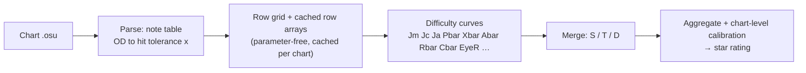
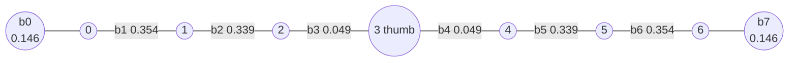
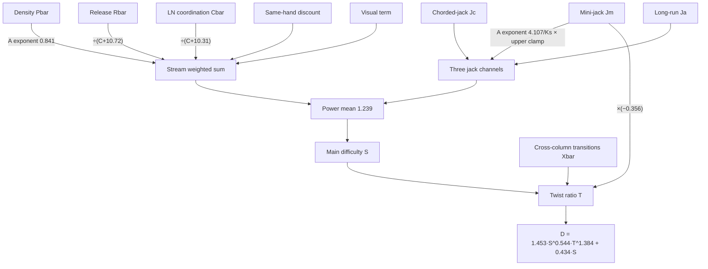
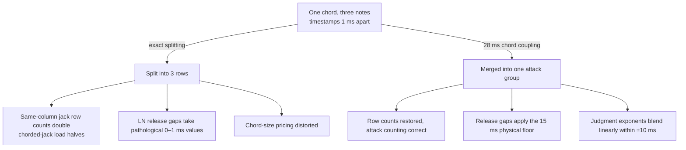

# SPM Rating v1.0.0 Algorithm Mechanism

This document describes the complete computation of SPM Rating v1.0.0 from chart to star rating, including the formulas and parameter values of each stage. No background in parameter tuning is required; terms are explained where they first appear. Two companion documents exist: the [history document](history.md) covers the differences from predecessor algorithms, the development process, and all findings; the [maintenance guide](maintenance.md) covers day-to-day use and version upgrades. All parameter values cited here are taken from the release parameter file [params/spm-rating-1.0.0.json](../params/spm-rating-1.0.0.json), which contains 248 parameters in total; values in the text are kept to about three significant digits, and the parameter file is authoritative.

## Overview

SPM Rating treats a chart as a difficulty curve over time: it first computes the difficulty of each moment, then aggregates the whole curve into a single star rating. The computation has five stages. The first stage parses the chart into a note sequence; the second organizes the notes into a uniform row grid; the third computes a dozen or so difficulty curves, each corresponding to a different hand motion; the fourth merges those curves into one overall difficulty curve; the fifth aggregates the overall curve into a star rating and applies chart-level calibration.

## 1. Input and Basic Concepts

The input is one osu!mania chart, i.e. a sequence of taps and holds; a tap is released as soon as it is pressed, while a hold is kept down for a while before release. Each note has three basic attributes: hit time, column, and (for holds) release time. Internally the algorithm always computes on a 7-column frame; 4-key charts are embedded according to the table below:

| 4-key original column | 0 | 1 | 2 | 3 |
|---|---|---|---|---|
| 7-column frame column | 1 | 2 | 4 | 5 |

The remaining columns stay empty. Inter-column physical distances are therefore identical across the two key counts, and the geometry logic can be shared.

The following concepts are used throughout.

| Concept | Meaning |
|---|---|
| Row | hits sharing a timestamp are merged into a row; notes struck at the same moment form a chord and belong to the same row |
| Columns and hands | columns are numbered 0 to 6 from left to right; column 3 is the thumb column. The left hand covers columns 0–2, the right hand columns 4–6. Columns are referred to simply as "columns" in the text |
| Hold count | the number of holds being held down by fingers at a given moment, not yet released |
| Hit tolerance | a time quantity derived from the chart's overall difficulty setting (OD), written $x$; the smaller the tolerance, the harder a given time interval is |

The hit tolerance is the only entry point of OD into the computation, converted in three steps:

$$q = \frac{64.5 - \lceil 3\,\mathrm{OD} \rceil}{500}, \qquad
x_0 = 0.3\sqrt{\max(q,\,10^{-6})}, \qquad
x = \min\!\big(x_0,\ 0.6(x_0 - 0.09) + 0.09\big)$$

OD 0 through 10 corresponds to $x$ between about 0.101 and 0.079 (in seconds, used on the same scale as intervals). Each curve further takes a power of $x$ with its own response exponent, written $x_f = x^{m_f}$:

| Curve | Response exponent $m_f$ |
|---|---|
| Jacks Jm | 0.750 |
| Density P | 1.126 |
| Cross-column transitions X | 1.165 |
| LN release R | 1.064 |
| Chorded jacks Jc | −0.371 |
| Long runs Ja | inherits Jm (the channel weight is zero, see Section 3) |

A positive exponent means the channel gets harder as judgment tightens ($x$ shrinks); the negative exponent of Jc means it is nearly insensitive to judgment strictness, with a slight reversal.

## 2. Computation Pipeline

Step one, parsing. Read the key list from the chart file to obtain each note's time, column, and hold-tail position, and convert OD into the hit tolerance (formula in Section 1). Notes sharing a timestamp are merged into a row; each row records a column mask, where a set bit means that column has a hit in this row.

Step two, layout. All charts are flattened into large arrays for vectorized computation; this is purely an engineering speedup and does not change the math. For each chart, the program precomputes and caches a set of parameter-independent row-level arrays:

- the gap from each row to the next;
- the distance to the next hit in each column;
- whether each column is active within a ±150 ms window, and the note count within a ±400 ms window;
- the imbalance of column usage;
- the number of simultaneously held long notes plus the held-column mask;
- the note count within a ±500 ms window (written $C$) and the number of active columns;
- per-column hit chains, per-adjacent-column-pair boundary chains, and per-hold-tail info tables.

Step three, difficulty curves. There are a dozen or so, each a time-varying array, described one by one from the next section on.

Step four, merging. Combine all curves into one overall difficulty value per row.

Step five, aggregation and calibration. Aggregate the overall curve into a star rating, then apply chart-level corrections.

A basic operation used throughout is **centered smoothing**: the step function $v$ on rows (each row's value holds until the next row) is integrated over a window of $W$ milliseconds and divided by the window width; the window is centered and truncated at chart boundaries:

$$\bar v(s) = \frac{1}{W}\int_{s - W/2}^{s + W/2} v(t)\,\mathrm{d}t$$

The smoothing widths per channel are as follows (parameters `w_jm`, `w_p`, etc.):

| Channel | Window (ms) |
|---|---|
| Jack family J | 843 |
| Density P | 806 |
| Cross-column transitions X | 939 |
| Rhythmic unevenness A | 61 |
| LN release R | 1349 |
| LN coordination C | 1140 |
| Same-hand chord density | 1071 |

Another mechanism used throughout is **chord coupling**. Chords with exact timestamps split into multiple rows under ±1 ms perturbations, and every quantity priced by row count is distorted. The release enables 28 ms chord coupling (`chord_tau_c = 28`): when the gap $\Delta$ between adjacent rows is below 28 ms, the later row carries a coupling weight toward the earlier one,

$$w = \mathrm{clip}\!\big(1 - \Delta / 28,\ 0,\ 1\big)$$

A zero gap merges the rows fully into one attack group; at 28 ms they become independent. This weight recurs in Section 3 (jack row counts and same-hand counting) and Section 5 (chord pricing and attack discount); Section 9 summarizes the five smoothing switches that include it.

## 3. Jack Channels

The jack channels measure the difficulty of consecutive hits in the same column — the main source of difficulty in jack charts. For each column, the interval $g$ between adjacent hits is computed first (seconds, floored at $10^{-4}$); the base kernel is

$$\mathrm{base}(g, x) = \frac{1}{g}\cdot\frac{1}{g + 0.1199\,x^{0.188}}
\times \Big(1 + 2.27{\times}10^{-5}\,\big(0.154 + |g - 0.074|\big)^{-4}\Big)$$

where $0.188 = 0.750 / 4$ comes from the Jm response exponent combined with the fourth-root shaping (parameters `j_c1`, `od_mult_jm`); the final correction term lifts the kernel by about 4% only near a 74 ms interval and decays rapidly away from it (parameters `j_nerf_*`). Shorter intervals give larger values, as do smaller tolerances. Four channels share this kernel and differ only in their modulation; a fast-jack term is added directly on top.

| Channel | Modulation | Merge weight |
|---|---|---|
| Raw Jbar | 1 (unmodulated) | does not enter the total difficulty in the release configuration (see Section 6) |
| Mini-jack Jm | dilution × triplet bonus (below) | 0.514 |
| Chorded-jack Jc | $(\mathrm{load} / 1.976)^{1.015}$ | 0.133 |
| Long-run Ja | saturation on same-column run length (below) | −0.0013 |

The mini-jack dilution factor is $1 / (1 + 0.2368\,\rho^{0.9615})$, where $\rho$ is the number of notes sandwiched between the two hits divided by the number of attack groups: more interleaved notes mean stronger dilution, reflecting the true difficulty of isolated mini-jacks. The triplet bonus is $1 + c_3\,\tau_3$: three consecutive same-column hits with a short enough total span get $\tau_3 = \max(0,\ 1 - \mathrm{span} / 0.272)$, with a gain of $c_3 = 0.019$ for 7-key and $0.536$ for 4-key (parameters `j_triple_gain`, `j_triple_gain_4k`, selected by chart key count).

The chorded-jack $\mathrm{load}$ is the total number of notes sandwiched between the two hits divided by the number of attack groups; thicker chords score higher (parameters `cj_norm`, `cj_size_exp`).

The long-run channel applies a saturating weight on same-column run length: longer runs are harder, up to a cap. Its merge weight converged to −0.0013, effectively zero. The channel's own computation is sound, but tuning showed that the long-run and mini-jack channels are highly correlated at row level; a fixed-weight scan is U-shaped with its minimum exactly at zero, 7-key hybrid charts want it positive while LN charts and 4-key charts want it negative, and the two demands cancel. The release keeps computing this curve because the locked-anchor term in Section 6 still uses it, but it no longer feeds the total difficulty directly.

Each channel is first smoothed over 843 ms into per-column curves $C_f$, then averaged across the 7 columns with a power mean of exponent 4.22, weighted by interval reciprocals:

$$J_f(s) = \Bigg(\sum_{k=0}^{6} \frac{1}{g_k}\, C_f(s)^{4.22} \Bigg/ \sum_{k=0}^{6} \frac{1}{g_k} \Bigg)^{1/4.22}$$

This channel has two supplementary terms. The **fast-jack term** handles same-column hit pairs with intervals under 150 ms; its shape $f = \frac{1}{g}(1 - g/0.15)$ falls continuously to zero at 150 ms, with a coefficient of 1.12 for 7-key and 1.64 for 4-key, added directly onto the mini-jack channel after smoothing (parameters `c_fj`, `c_fj_4k`). The **same-hand chord density** term handles rows where one hand plays two or more notes: the note counts $u_L$, $u_R$ of the left hand (columns 0–2) and the right hand (columns 4–6) within a ±28 ms triangular window (thumb column excluded), evaluated as $u\,\mathrm{clip}(u - 1,\ 0,\ 1)$, summed and smoothed, enter the stream branch as an independent curve with coefficient −0.189 (parameter `d_sh`) — a discount: same-hand chords subtract from the total difficulty. The direction defies intuition; its meaning is that part of the apparent density of same-hand chords is inflated and needs to be taken back.

## 4. Cross-Column Transition Channel

The cross-column transition channel measures the difficulty of moving fingers between columns. The 7 columns give 7 adjacent boundaries, plus two edge boundaries at the far left and far right (each containing only the edge column's own row chain), 8 in total. Each boundary merges the row chains of its two neighboring columns; every column belongs to exactly two boundaries, so streams in middle columns are always covered — there are no blind spots.

Adjacent events within a boundary are priced by inverse squared interval:

$$\mathrm{Xb} = 0.1478 \max(g,\ x^{1.165})^{-2}
\times
\begin{cases}
1 - 0.596\,\Delta & \text{inward (}\Delta > 0\text{)}\\[2pt]
1 + 0.986\,|\Delta| & \text{outward (}\Delta < 0\text{)}\\[2pt]
1 & \Delta = 0
\end{cases}
\qquad
\Delta = \big|e_{\text{from}} - 3\big| - \big|e_{\text{to}} - 3\big|$$

Inward means the landing column is closer to the thumb column than the starting column; outward means it is farther away. Chord-involved transitions are priced by effective column — when both sides are occupied, the midpoint is used, and the direction correction is naturally halved by the midpoint. Inward moves are discounted and outward moves cost extra. In terms of feel, outward moves toward the pinky side are usually harder than inward moves toward the thumb side, and the parameter directions agree (`x_amp`, `x_din`, `x_dout`).

Each boundary has a weight, shared in four groups by mirror symmetry: b1 and b6 (0.354), b2 and b5 (0.339), b3 and b4 (0.049), and the edges b0 and b7 (0.146). The boundaries next to the thumb column carry the lowest weights, matching intuition: transitions involving the thumb are inherently constrained (parameters `x_cw0` through `x_cw3`). Adjacent boundaries also share a fast-transition product term for the compounding effect of consecutive fast transitions, weight 1.663 (parameter `x_fc_w`).

This channel also contains a **geometric jump channel**: a 7×7 transition-cost matrix prices every transition in the global note sequence. Let $d$ be the distance between the two columns; the matrix takes values by case:

$$W_{ab} =
\begin{cases}
1 + 0.0457\,d^{1.077} & \text{default}\\
1 + 1.026\,d^{-1.681} & \text{same hand, } d > 0\\
1 - 0.559 / \max(d, 1) & \text{thumb column involved}\\
1 - 1.026 \min(d/7,\ 1) & \text{cross hand}
\end{cases}$$

A direction factor follows: landings closer to the thumb column (inward direction) multiply by $1 + 0.285$, otherwise by $1 - 0.017$. Each transition's cost is averaged over its row and divided by the row interval, producing a rate-weighted curve; the whole channel enters the transition curve with weight −0.852 (parameters including `x_jump_w`), the negative sign offsetting the jack component double-counted in the paired terms. All of the above is summed and smoothed over 939 ms into the transition channel $\mathrm{Xbar}$.

## 5. Density, Rhythmic Unevenness, and LN Release

### Density

The density channel measures how many keys must be pressed per unit time. The rate part of each row is

$$\mathrm{inc} = \frac{1}{d}\, f_P\, \mathrm{chw}(u)\, \mathrm{mix}$$

where $d$ is the gap to the next row (seconds) and $f_P$ is the fourth-root factor containing the tolerance:

$$f_P = \bigg(\frac{0.0586}{x^{1.126}}\Big(1 - \frac{27.84}{x^{1.126}}\,q^2\Big)\bigg)^{1/4},
\qquad q = \min\!\big(d - \tfrac{x^{1.126}}{2},\ \tfrac{x^{1.126}}{6}\big)$$

$\mathrm{chw}(u)$ is the chord-size price table; the price coefficients for chord sizes 2 through 7 are 0.700, 1.471, 0.821, 0.868, 0.747, and 1.033 (parameters `p_chw2` through `p_chw7`). $u$ is not the raw row size but the **effective chord size** within a ±28 ms triangular window: a chord split across several rows keeps close to its full group size, and the price table is linearly interpolated at non-integer sizes. $\mathrm{mix}$ consists of a burst-shape term and an LN-body term. For $r = 7.5/d$ between 186 and 401 a shape function exists,

$$\mathrm{bst}(r) = 1 - 10^{-5}\,(r - 186.3)(r - 401.4)^2$$

but the release parameter's shape strength is only of order $10^{-5}$ and the merge applies $\max(\mathrm{bst}, 1)$, so the value is always 1: the shape is neutralized under current parameters and kept only for compatibility. The LN-body term accumulates with hold count and row duration: $v - 1 = 0.00608\,h\,\Delta^{1.005}$, where $h$ is the number of holds being held in this row and $\Delta$ the row interval (milliseconds) — each additional occupied finger and each longer hold adds difficulty (the exponent 1.005 is used as 1). The release takes
$\mathrm{mix} = (1 - w_b)\max(\mathrm{bst}, 1) + \max(v - 1, 0)$, where $w_b$ is the coupling weight by which the row was absorbed into the previous row: a split chord's sub-rows count only $(1 - w_b)$ new attacks, preventing one chord from being priced as several full attacks. The discount applies to the rate part only; body occupancy is invariant under grid subdivision when summed over rows, and discounting it would move mass onto the wrong sub-row. The rate part ends here: first the column-usage multiplier and a soft clamp (below), then two burst terms added on top — the note counts $C_{100}$, $C_{150}$ within 100 ms and 150 ms windows, coefficients 0.575 and 0.277, giving short bursts extra credit.

Two corrections follow the sum. The first is the column-usage multiplier: let $\mathrm{anchor}$ be the imbalance-shape score of the column-usage distribution within a ±800 ms window (roughly 0 to 1; a pyramid shape with one column dominating and usage tapering on both sides scores high, while a uniform distribution and a single column score zero — it specifically captures the "certain columns overused" shape). The multiplier is

$$m_A = 1 - 0.327 \min\!\big(\mathrm{anchor} - 0.170,\ 6.806\,(\mathrm{anchor} - 0.349)^3\big)$$

The higher the imbalance score, the smaller the multiplier: charts over-relying on a few columns lose points. A soft clamp then keeps density values from blowing up: $\mathrm{inc} \leftarrow \min(\mathrm{inc} \cdot m_A,\ \max(\mathrm{inc},\ 2.035\,\mathrm{inc} - 10.69))$.
Finally an 806 ms smoothing produces the density curve $\mathrm{Pbar}$.

### Rhythmic Unevenness

Rhythmic unevenness is a pure multiplier, the curve $\mathrm{Abar}$. It examines the difference between the hit intervals of adjacent column pairs: pairs are matched by frame adjacency (0-1, 1-2, up to 5-6), with both columns required to be active within a ±150 ms window; in the 4-key embedding the thumb column is always empty, so the two pairs crossing it drop out automatically. Let $d_0$, $d_1$ be the two columns' intervals to their next hits:

$$dd = |d_0 - d_1| + 0.458 \max(0,\ m_x - 0.106), \qquad m_x = \max(d_0, d_1)$$

The pair multiplier has three segments (parameters `abar_*`):

$$\mathrm{val} =
\begin{cases}
\min(0.730 + 0.488\,m_x,\ 1) & dd < 0.0168\\[2pt]
\min(0.730 + 5.869\,(dd - 0.0168) + 0.488\,m_x,\ 1) & 0.0168 \le dd < 0.0945\\[2pt]
1 & dd \ge 0.0945
\end{cases}$$

When the interval difference falls below the small threshold (0.0168 s) the multiplier is below 1, approaching 1 as the difference grows. The middle segment is welded (its value at 0.0168 equals the first segment's) so the curve stays continuous at the threshold (`abar_weld` switch, see Section 9). The multipliers of all column pairs are multiplied together, smoothed over 61 ms, and scaled by an overall coefficient of 1.010.

### LN Release

The LN release channel computes the difficulty of the instant a hold is released, in three parts; the sum is smoothed over 1349 ms into $\mathrm{Rbar}$ and priced in the stream branch as $59.95 / (C + 10.72)$ ($C$ is the ±500 ms local note count, see Section 8).

**Part one, per-tail release.** Each hold tail is priced by the gap $\mathrm{dtr}$ to the next event (seconds, 15 ms physical floor) raised to the −1/2 power:

$$\mathrm{rv} = 0.0290\,\mathrm{dtr}^{-1/2}\,x^{-1.064}\,(1 + 1.061\,I)
\times [\text{same column} \to 0.394] \times \mathrm{cw}^{\,e} \times R_{\text{short}} \times S_0 \times (1 + 0.178\,L)$$

The terms:

- $I$ is the "busyness" of the two ends of the hold, reflecting the interval pressure near its head and tail:
  $$I = \frac{2}{2 + e^{-3.816\,(I_h - 1.680)} + e^{-3.816\,(I_t - 1.680)}}, \quad
  I_h = \frac{0.001\,|\mathrm{dur} - 80|}{x^{1.064}},\ \ I_t = \frac{0.001\,|t_{\text{next}} - t_{\text{tail}} - 80|}{x^{1.064}}$$
  $\mathrm{dur}$ is the hold duration (milliseconds); when no next event exists, $I_t$ is 10.
- The release exponent $e$ distinguishes whether the next event is a tail or a head: tails take 0.681, heads $0.681 \times 3.542 = 2.411$; when the two events are within 10 ms the exponents blend linearly instead of a hard decision (`r_sim_tau` switch). The same-column head case additionally takes a 0.394 reduction.
- The coordination weight $\mathrm{cw}$ depends on the relation between the tail column and the next event's column: same column 0.982, same hand 0.425, thumb 0.366, cross hand 0.690.
- The short-hold reduction $R_{\text{short}} = 0.109 + 0.891 \min(\mathrm{dur}, 440) / 440$: releases of very short holds are barely priced.
- The locked-hand bonus $L = \sum_j \mathrm{cw}(\text{this column}, j)$, summed over every column $j$ held by other fingers: the more columns held and the closer they are, the harder the release.
- The finger-independence factor $S_0$: for each held column $j$ a per-finger weight (ring 1.402, middle 0.849, index 0.989, thumb 1.481) is summed, the column's own share is subtracted, and the result enters with coefficient −0.115. The more columns held, the larger the reduction, largest when the thumb is held.

Releases with gaps beyond 5.985 s are not priced, and the outer 20% of the window uses a raised-cosine ramp instead of a hard cutoff (`r_soft_edges` switch); the release mass at truncation is renormalized to the actual time span so that a 1 ms perturbation cannot create difficulty out of nothing.

**Part two, tail-to-tail sequence.** The gap between adjacent hold tails is priced by the same −1/2 power: $0.0660\,\mathrm{dtr}^{-1/2}\,x^{-1.064}\,(1 + 1.061\,(I_i + I_{i+1}))\,\mathrm{cw}^{0.681}$.

**Part three, release-order triples.** If three holds in different columns of one hand release in a jumping order — the jump measured by how much |c1−c2|+|c2−c3| exceeds the three columns' span (max−min) — a penalty of $0.0498 \times \text{jump} / x^{1.064}$ applies; the judgment window is 404 ms with the same cosine ramp at its edges.

## 6. LN Coordination Channel and Hybrid-LN Supplements

The LN coordination channel handles hitting other keys while holds are kept down — the core of locked-hand charts. Which column is being held is the key to locked-hand difficulty, so the channel uses a 7×7 cross-column cost matrix $M$: $L_c = \sum_{j \ne c} M[c, j] \cdot \mathrm{held}_j$
measures which columns besides this one are held and how close they are — the locked-hand mass used repeatedly below. The matrix is grouped by mirror symmetry into five groups, with a zero diagonal; the release values are as follows (the locked-stack set, parameters `cbv_ls_*`):

| Group | Column pairs covered | Weight |
|---|---|---|
| Same-hand adjacent | (0,1) (1,2) (4,5) (5,6) | 0.990 |
| Same-hand split | (0,2) (4,6) | 0.694 |
| Thumb bridge | (1,3) (2,3) (3,4) (3,5) | 0.667 |
| Cross-hand adjacent | (2,4) | 0.628 |
| Far cross | (0,4) (0,5) (1,4) (1,5) (2,5) and other cross-hand pairs at distance ≥ 3 | 0.638 |

All six sub-terms are enabled, share a 1140 ms smoothing window, and clamp their output at zero.

**Shield**: a hold head on a column immediately preceded by another note. The preceding note is priced with decay $e^{-\Delta t / 75.3}$ within 256 ms; if the predecessor is a tap its weight is 1, if a hold it is reduced by $1.079\,e^{-\mathrm{dur}/145.4}$ (a hold predecessor already occupies the finger, making the re-strike cheaper); the result is amplified by $(1 + 1.087\,L_c)$ through the other held columns. Channel weight 1.120.

**Straddle jack**: two columns alternating while the column between them is held — the canonical case is columns 0 and 2 alternating with column 1 held. For every pair of columns $(a, b)$ at distance 2:

$$v = M_{ab} \cdot \sqrt{r_a r_b}\cdot \mathrm{bal}^{1.142} \cdot \mathrm{pin}$$

$r_a$, $r_b$ are the two columns' usage within a ±400 ms window; $\mathrm{bal} = 2\min(r_a, r_b) / (r_a + r_b)$ measures how balanced the alternation is; $\mathrm{pin} = \sum_m \mathrm{held}_m\, h_{\text{finger}(m)}$ weights the held middle column by finger group, with $h$ of ring 0.879, middle 0.911, index 0.856, thumb 0.503 — hardest when the middle finger is held. Pair-group weights: same-hand split 0.921, thumb bridge 0.532, cross hand 0.175. Channel weight 0.459.

**Locked stack**: each column's jack rate (same shape as the Section 3 jack kernel, computed per column and re-smoothed with this channel's 1140 ms window) times that column's locked-hand mass $L_c^{0.966}$, power-averaged across columns with exponent 4.22, weight 0.538. **Locked anchor**: identical to locked stack, but the jacks first pass a same-column run-length gate (the same saturating shape as the Section 3 long-run channel), weight 1.302. Neither term reuses the aggregated Jbar: the struck columns and the held columns must both be resolved per column, which neither a scalar hold count nor aggregate-then-modulate can do. The raw channel Jbar is therefore still computed but does not enter the total difficulty in the release configuration.

**Overlap jack**: two holds partially overlapping — the earlier one not yet released when the later one is already pressed with interleaved tails (containment, one hold inside the other, is strictly excluded as the cheaper hold-and-tap). The overlap duration is $\min(e_i - t_j,\ 2.451\text{ s})$, multiplied by the overlap matrix: same-hand adjacent 1.227, same-hand split 1.215, thumb bridge 0.891, cross-hand adjacent 0.629, far cross 0.432. Channel weight 0.986.

**Hold-and-tap**: tapping while holding elsewhere, weight −1.02, priced as the row's note count over the interval times the mean locked-hand mass of the row's notes. After the output clamp it forms a hard selective cancellation: in dense hold cores the locked terms are zeroed, at the edges they survive. The negative sign is not a typo but the repeatedly confirmed optimal shape; every softer reparameterization performed worse.

### Hybrid-LN Supplements

The four supplements are independent curves and do not pass through the matrix.

**Release crowding**: it measures not the release rate but **how many holds are simultaneously down and about to release**. Each tail leaves a mark on the row grid, time-averaged over a 1023 ms window, giving the number of holds on average in the about-to-release state at time $t$ (typically below 1 for a single-column release stream, about 2 for a two-column tail wall, capped at 7 with all columns stacked). The quantity $r$ then passes a concave saturation:

$$\mathrm{curve} = \frac{r}{1 + r / 14.71}$$

Weight 2.78. The saturation point 14.71 far exceeds $r$'s practical range, so the curve is nearly linear for single-column release streams and only reduces the surcharge when multiple columns form a tail wall — a mild effect under the release parameters. **Hold duration** computes the time holds occupy fingers: for each currently held LN per column, the held duration (seconds, capped at 0.971) minus 0.251, floored at zero, is accumulated — the first 0.25 s is not priced; weight 3.41. Both terms have 4-key override parameters whose release values are near zero, i.e. 4-key inherits the 7-key values; the screening conclusion is that 4-key needs no separate values. **Double-press density rate** is the rate of rows of size exactly 2 (998 ms window), weight 0.5, added directly to the stream branch. **Recovery discount** handles the breather after a burst: the part by which the short-window density (990 ms) exceeds the long-window baseline (21 s), $\max(C_s / C_l - 1,\ 0)$, is smoothed and used as the discount amount, subtracted from the stream branch as $0.781 \times \mathrm{rec} / (\mathrm{rec} + 0.489)$; in uniform streams the two windows read the same and nothing changes.

## 7. Visual Regularity Channel

The visual regularity channel addresses chart readability. For each row, take the log of the interval $\log \Delta t$, subtract the local geometric mean (4000 ms reference window), and fold by octave — the distance to the nearest integer number of octaves:

$$r = (\log \Delta t - \mu) \bmod \log 2, \qquad \mathrm{dist} = \min(r,\ \log 2 - r)$$

$\mathrm{dist}$ is smoothed (500 ms) and exponentiated into the alignment

$$R(t) = e^{-\mathrm{smooth}(\mathrm{dist}) / 0.2} \in (0, 1]$$

Perfectly on-beat rows score 1; rows off by half an octave (triplets against quarters) score markedly lower. The channel enters the stream branch as a density-gated interaction:

$$\text{visual term} = d_{\text{eye}} \cdot \mathrm{Pbar} \cdot R(t)$$

The 7-key coefficient is $d_{\text{eye}} = 0.082$, 4-key 0.014. The positive sign is the point: on-beat charts are systematically underestimated by the hand model and need extra credit, not a reading discount. The coefficient is small because it only tilts on-beat sections and prices nothing independently.

## 8. Merging, Aggregation, and Calibration

### Merge

The merge stage combines all curves into the total difficulty $D$ per row. The overall structure:

Before the power mean, the three jack channels and the stream branch are each gated by their Abar exponent, and the jack channels additionally pass an upper clamp:

$$B_f = \mathrm{Abar}^{\,a/K_s} \cdot \min\!\big(\max(f, 0),\ 10.85 + 0.767 \max(f, 0)\big)$$

where $K_s$ is the local active-column count (floored at 1); the exponent $a$ is 4.107 for the jack channels (divided by $K_s$). The clamp flattens the marginal contribution of isolated spikes; the stream branch takes only the Abar power gating, no clamp.

The stream branch is a weighted sum of the density, release, LN coordination, same-hand, and visual terms:

$$\mathrm{stream} = \mathrm{Abar}^{0.841}\Big(
a_P\,\mathrm{Pbar} + a_R \frac{\mathrm{Rbar}}{C + 10.72} + a_C \frac{\mathrm{Cbar}}{C + 10.31}
+ d_{sh}\,\mathrm{SHd} + d_{\text{eye}}\,\mathrm{Pbar}\,R(t)\Big) + 0.5\,\mathrm{Chord2} - \text{recovery discount}$$

The five terms inside the parentheses — density, release, coordination, same-hand, and visual — are all first multiplied by the $\mathrm{Abar}^{0.841}$ gate; the double-press density rate and the recovery discount act on the result outside the gate.

The release term is divided by the local note count $C$ plus 10.72 and the coordination term by $C$ plus 10.31: the denser the moment, the smaller the marginal contribution of a single release. The 7-key weights are $a_P = 0.457$, $a_R = 59.95$, $a_C = 4.0$; 4-key has its own density weight 0.967 and coordination weight 11.36, while release inherits the 7-key value (`a_r_4k` at zero means inherit, likewise below).

The three jack channels and the stream branch are combined by a power mean of exponent 1.239 into the main difficulty:

$$S = \Big(0.514\,B_{Jm}^{1.239} + 0.133\,B_{Jc}^{1.239} - 0.0013\,B_{Ja}^{1.239}
+ 0.418\,\max(\mathrm{stream}, 0)^{1.239}\Big)^{1/1.239}$$

The cross-column transition channel and the main body blend into a twist ratio:

$$T = \mathrm{Abar}^{5.704/K_s} \cdot \frac{X_t}{X_t + S + 0.482},
\qquad X_t = \mathrm{Xbar} - 0.356\,B_{Jm}$$

$X_t$ mixes in the jack channels' negative coefficient (−0.356): on jack-dominated rows the twist ratio tends to zero and the total difficulty degenerates to the linear term. This is a gate between jack sections and technical sections, not a supplement. The final shape of the total difficulty is

$$D = 1.453\,S^{0.544}\,T^{1.384} + 0.434\,S$$

### Aggregate

The aggregation stage turns the total difficulty curve into one score per chart; the release mode is a weighted power mean (`agg_mode = 3`). A very weak peak envelope is applied first: the difficulty curve's rolling maximum $E$ over a ±198 ms window is taken, and the actual curve becomes $D \leftarrow 0.9967\,D + 0.0033\,E$. The weight is only 0.0033 — essentially off; it is kept so narrow peaks are not drowned by averaging. Each row's weight is

$$w = \mathrm{gp}^{1.087} \cdot C^{1.145} \cdot \Big(1 - 4.833\,\frac{h}{h + 51.9}\Big)$$

$\mathrm{gp}$ is the row half-gap (the mean of the gaps to the previous and next rows), $C$ the local note count, $h$ the held-LN count: one held note lowers the weight to about 91%, seven to about 43% (held rows' weight share drops from 32% to 24%). The final score is

$$\mathrm{SR} = \Big(\sum w\,D^{3.923} \Big/ \sum w\Big)^{1/3.923}$$

### Calibrate

The calibration stage applies chart-level corrections, in order:

$$\mathrm{SR} \times \frac{n}{n + 59.29} \quad\to\quad
\mathrm{SR} > 7.70 \Rightarrow 7.70 + \frac{\mathrm{SR} - 7.70}{1.618} \quad\to\quad
\times 1.027 \times 1.002,\ +0.507$$

$n$ is the note count: charts with few notes are discounted, with the knee at about 59 notes; values above 7.70 are compressed; a final linear calibration follows (1.027 and 1.002 are two scale factors multiplied together). 4-key charts have no separate output-side calibration: the scale difference between the two key counts is carried entirely by the per-row overrides described above — the stream weights (`a_p_4k`, `a_cb_4k`) and the jack gains (`j_triple_gain_4k`, `c_fj_4k`) — the only key-count differentiation mechanism.

## 9. Smoothing Switches

The release parameters enable five smoothing switches by default, which remove fake difficulty caused by timestamp discreteness. Take a three-note chord with timestamps 1 ms apart:

The five switches, their thresholds, and where they act:

| Switch | Threshold | Where it acts |
|---|---|---|
| Chord coupling `chord_tau_c` | 28 ms | jack row counts, chord pricing, attack discount, same-hand counting |
| Release gap floor `r_dtr_min` | 15 ms | the $\mathrm{dtr}^{-1/2}$ pricing in the release channel |
| Judgment blending band `r_sim_tau` | 10 ms | the tail/head decision of the release exponent |
| Outer cosine ramp `r_soft_edges` | — | both truncation windows of the release channel |
| Rhythm threshold weld `abar_weld` | — | the middle segment of rhythmic unevenness (already in the Section 5 formula) |

Without these switches, exact-timestamp row splitting double-counts split chords: under ±1 ms perturbations the 7-key correlation falls from 0.984 to 0.488. With them on, the untuned 7-key score drops by about 0.003, yet the unseen 6-key score hits a new high — evidence that what was removed was overfitting to label noise. After retuning with the same budget, perturbation median errors fall to 0.178 (7-key) and 0.039 (4-key), and correlations computed under perturbation (below, "stressed correlations") recover to 0.976 and 0.999. The 7-key median is still above the 0.05 ideal, but further smoothing would require changing the release channel's functional form, and tuning shows that channel genuinely uses this signal — so only a mechanism redesign can fix it, not more parameter tuning.

## 10. Reading the Parameter Table

The release parameter file contains 248 parameters; this text cites only the decisive ones, with [params/spm-rating-1.0.0.json](../params/spm-rating-1.0.0.json) authoritative for exact values. A few parameters sit in off, inherit, or unwired states:

- **Near zero means off**: the long-run channel weight of −0.0013 marks the channel as redundant, its curve kept only for the locked anchor; zero 4-key override parameters (e.g. `a_r_4k`, `cbv_churn_4k`) mean the 7-key value is inherited; the envelope weight of 0.0033 means essentially off. Every "essentially off" parameter in this text is one of these cases.
- **Branches off by default**: the read-branch (`use_read`) and the four v1 locked terms of LN coordination (`cb_lockjack` etc.) are all zero in the release; v1's role is carried by the Section 6 v2 matrix channel, and the v1 parameters are kept only for compatibility with older parameter files.
- **Unwired residue**: `out_a` and `out_b` have non-trivial values in the parameter file (0.700, −0.783) but the current post-processing code does not read them; the 4-key output scale is carried by the per-row overrides (Section 8). Do not tune against these two values; the companion `_couple` helper likewise has no call sites. See the [history document](history.md) for the record of dead parameters.
