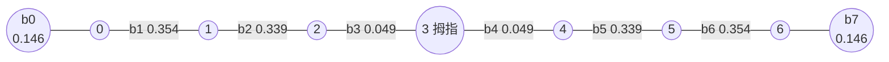
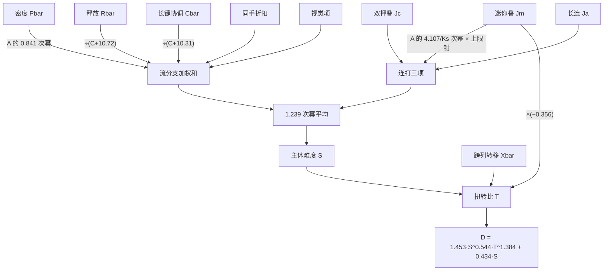
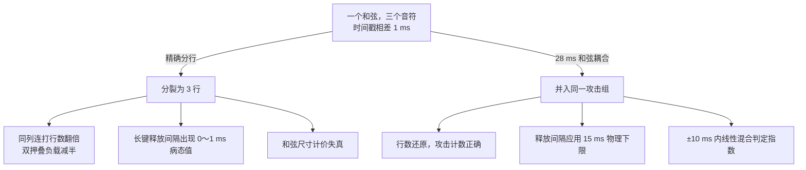

# SPM Rating v1.0.0 算法机制说明

本文给出 SPM Rating v1.0.0 从谱面到星数的完整计算过程，包括各阶段的
公式与参数取值。阅读本文不需要参数调优方面的背景，术语在首次出现处说明。
配套文档另有两种：[《研制历程与结论》](history.zh-CN.md)论述本算法与前代
的差异、研制过程与全部结论；[《维护与升级》](maintenance.zh-CN.md)介绍
日常使用与版本升级。文中引用的参数值均取自发布参数文件
[params/spm-rating-1.0.0.json](../params/spm-rating-1.0.0.json)，该文件共
248 个参数；正文数值保留三位左右有效数字，完整数值以参数文件为准。

## 总体思路

SPM Rating 将一张谱面视为一条随时间变化的难度曲线：先求出各时刻的难度，
再将整条曲线聚合成一个星数。计算分五个阶段。第一阶段解析谱面，得到音符
序列；第二阶段将音符整理成统一的行网格；第三阶段计算十余条难度曲线，
分别对应不同的手部动作；第四阶段将各条曲线合并为一条总难度曲线；第五
阶段将总难度曲线聚合成星数并做谱面级标定。

## 1. 输入与基本概念

输入是一张 osu!mania 谱面，即点键与长键组成的序列；点键按下即松开，长键
按下后保持一段时间再松开。每个音符有三个基本属性：击打时间、所在轨道、
长键的松开时间。算法内部统一在 7 轨道框架下计算，4 键谱面按下表嵌入：

| 4 键原始列 | 0 | 1 | 2 | 3 |
|---|---|---|---|---|
| 7 轨道列 | 1 | 2 | 4 | 5 |

其余轨道保持空白。两套键数下列间物理距离因此一致，几何逻辑得以共用。

以下概念贯穿全文，先在此说明。

| 概念 | 含义 |
|---|---|
| 行 | 时间戳相同的击打合并成一行；同一时刻同时击中的音符构成一个和弦，属于同一行 |
| 轨道与手 | 轨道从左到右编号 0 到 6，第 3 列是拇指列；左手负责 0 到 2 列，右手负责 4 到 6 列。轨道在行文中简称"列" |
| 按住数 | 某一时刻正被手指按住、尚未松开的长键数量 |
| 击打宽容度 | 由谱面的整体判定难度（OD）换算而来的时间量，记作 $x$；宽容度越小，同样的时间间隔越难 |

击打宽容度是 OD 进入计算的唯一切入点，换算分三步：

$$q = \frac{64.5 - \lceil 3\,\mathrm{OD} \rceil}{500}, \qquad
x_0 = 0.3\sqrt{\max(q,\,10^{-6})}, \qquad
x = \min\!\big(x_0,\ 0.6(x_0 - 0.09) + 0.09\big)$$

OD 0 到 10 对应 $x$ 约 0.101 至 0.079（单位秒，与间隔同尺度使用）。
每条曲线再按各自的响应指数取 $x$ 的幂，记作 $x_f = x^{m_f}$：

| 曲线 | 响应指数 $m_f$ |
|---|---|
| 连打 Jm | 0.750 |
| 密度 P | 1.126 |
| 跨列转移 X | 1.165 |
| 长键释放 R | 1.064 |
| 双押叠 Jc | −0.371 |
| 长连 Ja | 沿用 Jm（该通道权重为零，见第三节） |

指数大于零表示判定越严（$x$ 越小）该通道越难；Jc 的负指数表示它对判定
宽严几乎不敏感，甚至轻微反向。

## 2. 计算管线

第一步，解析。读取谱面文件中的按键列表，得到每个音符的时间、列与长键
尾部位置，同时由 OD 换算出击打宽容度（公式见第一节）。时间戳相同的音符
合并为一行，每行记录一个列掩码：掩码中为 1 的位表示该列在本行有击打。

第二步，整理。将全部谱面摊平成一组大数组统一计算，这是工程上的加速手段，
不影响数学含义。对每张谱面，程序预先计算一批与参数无关的行级数组并缓存：

- 每行到下一行的间隔；
- 每列到下一次击打的距离；
- 每列在 ±150 毫秒窗口内是否活跃、±400 毫秒窗口内的音符数；
- 列间用量的不平衡度；
- 同时按住的长键数与按住列掩码；
- ±500 毫秒窗口内的音符数（记作 $C$）与活跃列数；
- 每列的击打链、每对相邻列的边界链、每条长键尾部的信息表。

第三步，计算难度曲线。共十余条，均为随时间变化的数组，自下一节起逐条
说明。

第四步，合并。将各条曲线在每一行合并为一个总难度值。

第五步，聚合与标定。将总难度曲线聚合成星数，再做谱面级修正。

贯穿全文的一个基本运算是**中心平滑**：将行上的阶梯函数 $v$（每行的值
保持到下一行）在宽度 $W$ 毫秒的窗口内积分并除以窗宽；窗口居中，越出谱面
边界时截断：

$$\bar v(s) = \frac{1}{W}\int_{s - W/2}^{s + W/2} v(t)\,\mathrm{d}t$$

各通道的平滑窗宽如下（对应参数 `w_jm`、`w_p` 等）：

| 通道 | 窗宽（毫秒） |
|---|---|
| 连打族 J | 843 |
| 密度 P | 806 |
| 跨列转移 X | 939 |
| 节奏不均匀度 A | 61 |
| 长键释放 R | 1349 |
| 长键协调 C | 1140 |
| 同手和弦密度 | 1071 |

另一个贯穿全文的机制是**和弦耦合**。精确时间戳的和弦在 ±1 毫秒扰动下会
分裂成多行，所有按行数计价的量都会失真。发布参数打开 28 毫秒和弦耦合
（`chord_tau_c = 28`）：相邻两行间隔 $\Delta$ 小于 28 毫秒时，后行对前行
带耦合权重

$$w = \mathrm{clip}\!\big(1 - \Delta / 28,\ 0,\ 1\big)$$

间隔为零则完全并入同一攻击组，间隔达到 28 毫秒则互不影响。该权重在
第三节（连打行数与同手计数）、第五节（和弦定价与攻击折扣）中反复出现；
第九节汇总了包含它在内的五个平滑开关。

## 3. 连打通道

连打通道衡量同一列连续击打的难度，叠键谱的难度主要来源于此。对每列
先计算相邻两次击打的间隔 $g$（单位秒，下限 $10^{-4}$），基础核函数为

$$\mathrm{base}(g, x) = \frac{1}{g}\cdot\frac{1}{g + 0.1199\,x^{0.188}}
\times \Big(1 + 2.27{\times}10^{-5}\,\big(0.154 + |g - 0.074|\big)^{-4}\Big)$$

其中 $0.188 = 0.750 / 4$，来自 Jm 的响应指数与四次根修饰（参数 `j_c1`、
`od_mult_jm`）；末尾的修正项只在间隔 74 毫秒附近抬升约 4%，随间隔偏离
快速衰减（参数 `j_nerf_*`）。间隔越短值越大，宽容度越小值越大。四个通道
共用同一核函数，仅调制系数不同；另有快叠项直接叠加。

| 通道 | 调制系数 | 合并权重 |
|---|---|---|
| 原始 Jbar | 1（不加调制） | 发布配置下不进入总难度（见第六节） |
| 迷你叠 Jm | 稀释 × 三连增益（下文） | 0.514 |
| 双押叠 Jc | $(\mathrm{load} / 1.976)^{1.015}$ | 0.133 |
| 长连 Ja | 同列连跑长度饱和（下文） | −0.0013 |

迷你叠的稀释因子为 $1 / (1 + 0.2368\,\rho^{0.9615})$，$\rho$ 为两次击打
之间夹带的音符数除以攻击组数：夹杂越多稀释越强，以此体现孤立小叠的真实
难度。三连增益为 $1 + c_3\,\tau_3$：连续三次同列击打且总跨度 $\mathrm{span}$ 足够
短时，$\tau_3 = \max(0,\ 1 - \mathrm{span} / 0.272)$，增益系数 7 键
$c_3 = 0.019$、4 键 $0.536$（参数 `j_triple_gain`、`j_triple_gain_4k`，
按谱面键数取用）。

双押叠的 $\mathrm{load}$ 为两次击打间夹带的总音符数除以攻击组数，和弦越厚
值越大（参数 `cj_norm`、`cj_size_exp`）。

长连通道按同列连跑长度做饱和加权：连跑越长越难，但有上限。其合并权重
收敛至 −0.0013，实质为零。该通道本身的计算并无问题，但调参表明
长连与迷你叠在行级别高度相关，固定权重扫描呈 U 形、最小值恰好落在零点；
7 键混合谱要求其为正，长键谱与 4 键谱要求其为负，两边互相抵消。发布版本
保留这条曲线的计算，因为第六节锁手锚仍需使用它，但它不再直接进入总难度。

每个通道先做 843 毫秒平滑得到各列曲线 $C_f$，再按间隔倒数加权，在 7 列
之间做 4.22 次幂平均：

$$J_f(s) = \Bigg(\sum_{k=0}^{6} \frac{1}{g_k}\, C_f(s)^{4.22} \Bigg/ \sum_{k=0}^{6} \frac{1}{g_k} \Bigg)^{1/4.22}$$

本通道还有两个补充项。**快叠项**处理间隔小于 150 毫秒的同列快速击打对，
形状
$f = \frac{1}{g}(1 - g/0.15)$ 在 150 毫秒处连续归零，系数 7 键 1.12、
4 键 1.64，平滑后直接加到迷你叠通道上（参数 `c_fj`、`c_fj_4k`）。
**同手和弦密度**处理单手同行出现两个以上音符的情形：左手（0 到 2 列）与
右手（4 到 6 列）各自在 ±28 毫秒三角窗内的音符数 $u_L$、$u_R$（拇指列不计），
取 $u\,\mathrm{clip}(u - 1,\ 0,\ 1)$ 后求和、平滑，作为独立曲线进入流分支，
系数为 −0.189（参数 `d_sh`），是一个折扣项：同手多押在总难度中为减分项。
该方向有违直觉，其含义是同手和弦的表面密度有一部分是虚高的，需要扣回。

## 4. 跨列转移通道

跨列转移通道衡量手指在不同列之间移动的难度。7 列之间有 7 条相邻
边界，外加最左、最右两条边缘边界（各自只含边缘列自身的行链），共 8 条。
每条边界合并相邻两列的行链；每列恰好属于两条边界，所以中间列的连打一直
被计入，不存在盲区。

边界内相邻两个事件按间隔平方反比计价：

$$\mathrm{Xb} = 0.1478 \max(g,\ x^{1.165})^{-2}
\times
\begin{cases}
1 - 0.596\,\Delta & \text{内切（}\Delta > 0\text{）}\\[2pt]
1 + 0.986\,|\Delta| & \text{外切（}\Delta < 0\text{）}\\[2pt]
1 & \Delta = 0
\end{cases}
\qquad
\Delta = \big|e_{\text{起}} - 3\big| - \big|e_{\text{落}} - 3\big|$$

内切指切换落点比起点更靠近拇指列，外切指落点更远离拇指列；和弦参与的
切换按有效列计价，两侧都占时取中点，方向修正随之中点化而自然减半。
即内切减价、外切加价。就手感而言，向小指一侧的外切通常比向拇指一侧的
内切更难，参数方向与此一致（`x_amp`、`x_din`、`x_dout`）。

每条边界各有一个权重，按镜像对称分成四组共享：b1 与 b6 一组（0.354），
b2 与 b5 一组（0.339），b3 与 b4 一组（0.049），边缘 b0 与 b7 一组
（0.146）。拇指两侧边界的权重最低，符合直觉：拇指参与的转移天然受限
（参数 `x_cw0` 到 `x_cw3`）。相邻边界之间另有快转乘积项，用于连续
快速转移的叠加效应，权重 1.663（参数 `x_fc_w`）。

该通道还包含**几何跳跃通道**：用一张 7 乘 7 的转移代价矩阵为全局音符序
列中的每一次转移定价。设 $d$ 为两列距离，矩阵按情形取值：

$$W_{ab} =
\begin{cases}
1 + 0.0457\,d^{1.077} & \text{默认}\\
1 + 1.026\,d^{-1.681} & \text{同手且 } d > 0\\
1 - 0.559 / \max(d, 1) & \text{涉及拇指列}\\
1 - 1.026 \min(d/7,\ 1) & \text{跨手}
\end{cases}$$

再乘方向系数：落点更靠近拇指列（内切方向）乘 $1 + 0.285$，反之乘
$1 - 0.017$。每次转移的代价按其所属行取均值、除以行间隔，得到一条速率
加权曲线；整个通道以 −0.852 的权重加入转移曲线（参数 `x_jump_w` 等），
负号用于对冲成对项中被重复计算的连打成分。以上各项求和后做 939 毫秒
平滑，得到转移通道 $\mathrm{Xbar}$。

## 5. 密度、节奏不均匀度与长键释放

### 密度通道

密度通道衡量单位时间内需按下的键数。每行的速率部分为

$$\mathrm{inc} = \frac{1}{d}\, f_P\, \mathrm{chw}(u)\, \mathrm{mix}$$

其中 $d$ 为到下一行的间隔（秒），$f_P$ 为含宽容度的四次根因子：

$$f_P = \bigg(\frac{0.0586}{x^{1.126}}\Big(1 - \frac{27.84}{x^{1.126}}\,q^2\Big)\bigg)^{1/4},
\qquad q = \min\!\big(d - \tfrac{x^{1.126}}{2},\ \tfrac{x^{1.126}}{6}\big)$$

$\mathrm{chw}(u)$ 为和弦尺寸定价表，和弦尺寸 2 到 7 的定价系数分别为
0.700、1.471、0.821、0.868、0.747、1.033（参数 `p_chw2` 到 `p_chw7`）。
$u$ 并非原始行尺寸，而是 ±28 毫秒三角窗内的**有效和弦尺寸**：被拆分成
数行的和弦仍保持接近完整的组尺寸，定价表在非整数尺寸处线性插值。
$\mathrm{mix}$ 由两部分组成：突发形状项与长键身体增益项。
$r = 7.5/d$ 落在 186 到 401 之间时存在一个形状函数

$$\mathrm{bst}(r) = 1 - 10^{-5}\,(r - 186.3)(r - 401.4)^2$$

但发布参数的形状强度仅为 $10^{-5}$ 量级，且合并时套用
$\max(\mathrm{bst}, 1)$，实际取值恒为 1，即该形状已被当前参数中和，保留
仅为兼容。长键身体增益随按住数与本行时长累计：
$v - 1 = 0.00608\,h\,\Delta^{1.005}$，$h$ 为本行按住的长键数，$\Delta$ 为
本行间隔（毫秒）：每多占用一根手指、按住时间越长，难度越高
（指数 1.005 实际按 1 使用）。发布参数取
$\mathrm{mix} = (1 - w_b)\max(\mathrm{bst}, 1) + \max(v - 1, 0)$，其中
$w_b$ 为该行被前一行吸收的耦合权重：被拆开的和弦其子行只计
$(1 - w_b)$ 个新攻击，避免将一个和弦计为多次完整攻击。该折扣只作用于
速率部分；身体占用在行求和下与网格划分无关，折扣反而会将质量转移到
错误的子行。速率部分至此完成：先乘列用量乘子、过软钳（下文），
再叠加两个爆发项，取宽度 100 毫秒与 150 毫秒窗口内的音符数
$C_{100}$、$C_{150}$，系数 0.575 与 0.277，为短爆发额外加分。

求和后做两步修正。第一步是列用量乘子：记 $\mathrm{anchor}$ 为 ±800 毫秒
窗口内列用量分布的失衡形状分（取值约 0 到 1；某列用量向两侧逐级递减的
金字塔形取高值，均匀分布与单列取零，用以捕捉"某些列被过度使用"的形状），
乘子为

$$m_A = 1 - 0.327 \min\!\big(\mathrm{anchor} - 0.170,\ 6.806\,(\mathrm{anchor} - 0.349)^3\big)$$

失衡分越高乘子越小，过度依赖某几列的谱面减分。
再做软钳制以防止密度值无限放大：$\mathrm{inc} \leftarrow \min(\mathrm{inc} \cdot m_A,\ \max(\mathrm{inc},\ 2.035\,\mathrm{inc} - 10.69))$。
最后做 806 毫秒平滑，得到密度曲线 $\mathrm{Pbar}$。

### 节奏不均匀度

节奏不均匀度为纯乘子，对应曲线 $\mathrm{Abar}$。它考察相邻两列各自
的击打间隔之差：列对按框架相邻关系配对（0-1、1-2 直至 5-6），且要求两列
在 ±150 毫秒窗口内均活跃；4 键嵌入时拇指列恒为空，跨拇指的两对自动退出。
$d_0$、$d_1$ 为两列各自到下一次击打的间隔，取

$$dd = |d_0 - d_1| + 0.458 \max(0,\ m_x - 0.106), \qquad m_x = \max(d_0, d_1)$$

列对乘子分三段（参数 `abar_*`）：

$$\mathrm{val} =
\begin{cases}
\min(0.730 + 0.488\,m_x,\ 1) & dd < 0.0168\\[2pt]
\min(0.730 + 5.869\,(dd - 0.0168) + 0.488\,m_x,\ 1) & 0.0168 \le dd < 0.0945\\[2pt]
1 & dd \ge 0.0945
\end{cases}$$

间隔差低于小阈值（0.0168 秒）时给予小于 1 的乘子，差值越大越接近
1。中段经过焊接处理（中段在 0.0168 处的取值与第一段相同），保证在阈值处
连续（`abar_weld` 开关，见第九节）。全部列对的乘子连乘，做 61 毫秒平滑，
乘 1.010 的整体系数。

### 长键释放通道

长键释放通道计算松开长键瞬间的难度，分三段；全部求和后做 1349 毫秒
平滑得到 $\mathrm{Rbar}$，在流分支中按 $59.95 / (C + 10.72)$ 计价
（$C$ 为 ±500 毫秒局部音符数，见第八节）。

**第一段，逐尾释放。**每条长键尾部到下一个事件的间隔 $\mathrm{dtr}$
（秒，15 毫秒物理下限）按负二分之一次方定价：

$$\mathrm{rv} = 0.0290\,\mathrm{dtr}^{-1/2}\,x^{-1.064}\,(1 + 1.061\,I)
\times [\text{同列} \to 0.394] \times \mathrm{cw}^{\,e} \times R_{\text{short}} \times S_0 \times (1 + 0.178\,L)$$

各项含义如下：

- $I$ 为长键两端的"繁重度"，反映该长键头尾附近的间隔压力：
  $$I = \frac{2}{2 + e^{-3.816\,(I_h - 1.680)} + e^{-3.816\,(I_t - 1.680)}}, \quad
  I_h = \frac{0.001\,|\mathrm{dur} - 80|}{x^{1.064}},\ \ I_t = \frac{0.001\,|t_{\text{next}} - t_{\text{tail}} - 80|}{x^{1.064}}$$
  $\mathrm{dur}$ 为长键时长（毫秒）；下一事件不存在时 $I_t$ 取 10。
- 释放指数 $e$ 区分下一事件是尾部还是头部：尾部取 0.681，头部取
  $0.681 \times 3.542 = 2.411$；两事件相隔 10 毫秒以内时两个指数线性混合，
  不做硬判决（`r_sim_tau` 开关）。同列头部情形另乘 0.394 的减免。
- 协调权重 $\mathrm{cw}$ 按尾部列与下一事件列的关系取值：同列 0.982、
  同手 0.425、拇指 0.366、跨手 0.690。
- 短长键减免 $R_{\text{short}} = 0.109 + 0.891 \min(\mathrm{dur}, 440) / 440$，
  极短长键的释放几乎不计价。
- 锁手加成 $L = \sum_j \mathrm{cw}(\text{本列}, j)$，对每个被其他手指
  按住的列 $j$ 求和：按住的列越多、越近，该次释放越难。
- 跨指独立性因子 $S_0$：对每个被按住的列 $j$ 按手指取一组权重（环指
  1.402、中指 0.849、食指 0.989、拇指 1.481）求和，再减去本列自身项，
  以系数 −0.115 进入。按住的列越多，该项减得越多，其中拇指按住时减得
  最多。

间隔超过 5.985 秒的释放不计价，且最后 20% 区间用外层余弦坡代替硬截断
（`r_soft_edges` 开关）；截断处的释放质量按实际时间跨度重新归一，保证
1 毫秒的扰动不会凭空制造难度。

**第二段，尾到尾序列。**相邻两条长键尾部之间的间隔同样按负二分之一次方
定价：$0.0660\,\mathrm{dtr}^{-1/2}\,x^{-1.064}\,(1 + 1.061\,(I_i + I_{i+1}))\,\mathrm{cw}^{0.681}$。

**第三段，释放顺序三元组。**同手三条不同列的长键若释放顺序跳跃，跳跃量
按 |c1−c2|+|c2−c3| 超出三列跨度（max−min）的部分计，以
$0.0498 \times \text{跳跃量} / x^{1.064}$ 加罚；判定窗 404 毫秒，窗边同样
采用余弦坡。

## 6. 长键协调通道与混合长键补充项

长键协调通道处理按住长键的同时还需击打其他键的情形，是锁手谱的核心。
锁手难度的关键在于被按住的是哪一列，因此该通道采用 7 乘 7 的
跨列代价矩阵 $M$：$L_c = \sum_{j \ne c} M[c, j] \cdot \mathrm{held}_j$
衡量本列之外还有哪些列被按住、按住得多近，即后文反复使用的
锁手质量。矩阵按镜像对称分五组，对角线
为零，发布值如下（以锁手叠的一组为准，参数 `cbv_ls_*`）：

| 组 | 覆盖的列对 | 权重 |
|---|---|---|
| 同手相邻 | (0,1) (1,2) (4,5) (5,6) | 0.990 |
| 同手隔列 | (0,2) (4,6) | 0.694 |
| 拇指桥接 | (1,3) (2,3) (3,4) (3,5) | 0.667 |
| 跨手相邻 | (2,4) | 0.628 |
| 远跨 | (0,4) (0,5) (1,4) (1,5) (2,5) 等距离 ≥ 3 的跨手对 | 0.638 |

六个子项全部开启，共用 1140 毫秒平滑窗，输出钳制在零以上。

**盾**：同列长键头紧跟前音的情形。前音在 256 毫秒内按
$e^{-\Delta t / 75.3}$ 衰减计价；前音为点键时权重 1，为长键时按
$1.079\,e^{-\mathrm{dur}/145.4}$ 折减（长键前音已占用手指，重复击打的
成本较低）；再乘 $(1 + 1.087\,L_c)$ 被其他按住列放大。通道权重 1.120。

**衩叠**：两列交替击打而中间一列被按住，典型例子为 0 列与 2 列交替、
1 列被按住。对每一对距离为 2 的列 $(a, b)$：

$$v = M_{ab} \cdot \sqrt{r_a r_b}\cdot \mathrm{bal}^{1.142} \cdot \mathrm{pin}$$

$r_a$、$r_b$ 为两列 ±400 毫秒窗口内的用量；$\mathrm{bal} = 2\min(r_a, r_b) / (r_a + r_b)$
衡量交替是否均衡；$\mathrm{pin} = \sum_m \mathrm{held}_m\, h_{\text{指}(m)}$
对被按住的中间列按手指分组加权，$h$ 为环指 0.879、中指 0.911、食指 0.856、
拇指 0.503，中指被按住时最难。对组权重：同手隔列 0.921，拇指桥接 0.532，
跨手 0.175。通道权重 0.459。

**锁手叠**：每列连打速率（与第三节连打核同形，按列单独计算、用本通道
1140 毫秒窗重新平滑）乘以该列的锁手质量 $L_c^{0.966}$，再做列间 4.22 次
幂平均，权重 0.538。**锁手锚**：与锁手叠相同，但连打先经过同列连跑长度门
（与第三节长连通道同形的饱和函数），权重 1.302。两项均不复用聚合后的
Jbar：击打与被按住的列都必须按列分辨，这是标量化的按住数与
先聚合后调制两种做法都无法做到的。原始通道 Jbar 的计算因此保留，但在
发布配置下不进入总难度。

**面叠**：两条长键部分重叠，前一条尚未松开、后一条已经按下且尾部交错
（严格排除一条包住另一条的包含情形，该情形属于成本更低的按住内击打）。
重叠时长按 $\min(e_i - t_j,\ 2.451\text{ 秒})$ 计，乘面叠矩阵：同手相邻 1.227、
同手隔列 1.215、拇指桥接 0.891、跨手相邻 0.629、跨手远隔 0.432。通道
权重 0.986。

**按住敲击**：按住其他列的同时击打点键，权重 −1.02，计价为每行音符数
除以间隔、再乘本行各音符锁手质量的均值。经过输出钳后形成硬选择性抵消：
在高强度按住的核心区将锁项清零，在边缘区保留。该负号并非笔误，而是数据
反复确认的最优形状，所有较柔和的重参数化形式均劣于它。

### 混合长键补充项

四个补充项均为独立曲线，不经过矩阵。

**释放拥挤度**：衡量的不是释放速率，而是
**同时在按、即将松开的长键条数**。每条尾部在行上留下印记，以 1023 毫秒
窗做时间平均，得到时刻 $t$ 处平均处于即将释放状态的长键条数（单列释放流
的典型值不足 1，双列尾部墙约 2，七列叠满时上限为 7）。该量 $r$ 再经
凹饱和曲线计价：

$$\mathrm{curve} = \frac{r}{1 + r / 14.71}$$

权重 2.78。饱和点 14.71 远超 $r$ 的实际取值范围，因此对单列释放流近似
线性，仅在多列尾部形成尾部墙时压低加价，在发布参数下作用温和。
**按住时长**计算长键占用手指的时间：对每列正在按住的长键，取已按住的
时长（秒，上限 0.971）减去 0.251、负值截为零后累加，即前 0.25 秒不计价，
权重 3.41。两项均有 4 键覆盖参数，
发布值接近零，表示 4 键直接沿用 7 键的值；筛选结论是 4 键无需单独的
取值。**双押密度率**为尺寸恰为 2 的行的速率（998 毫秒窗），权重 0.5，
直接加入流分支。**恢复折扣**处理爆发之后的喘息：短窗密度（990 毫秒）
超过长窗基线（21 秒）的部分 $\max(C_s / C_l - 1,\ 0)$ 经平滑后作为折扣
量，从流分支中按 $0.781 \times \mathrm{rec} / (\mathrm{rec} + 0.489)$
减去；均匀的流动段两个窗口读数相等，不受影响。

## 7. 视觉规整度通道

视觉规整度通道关注谱面的可读性。对每行取间隔的对数
$\log \Delta t$，减去局部几何平均（4000 毫秒参考窗）得到偏离量，再按
八度折叠，取到最近整数个八度的距离：

$$r = (\log \Delta t - \mu) \bmod \log 2, \qquad \mathrm{dist} = \min(r,\ \log 2 - r)$$

$\mathrm{dist}$ 经平滑（500 毫秒）后取指数，得到对齐度

$$R(t) = e^{-\mathrm{smooth}(\mathrm{dist}) / 0.2} \in (0, 1]$$

完全对拍的行取值为 1，偏离半个八度（三连对四分）的行显著低于 1。
该通道以密度门控交互的形式进入流分支：

$$\text{视觉项} = d_{\text{eye}} \cdot \mathrm{Pbar} \cdot R(t)$$

7 键系数 $d_{\text{eye}} = 0.082$，4 键为 0.014。正号的含义是：规整的谱面
被手部模型系统性低估，需要加分而非读谱折扣。系数较小，因为它仅为对拍
段落提供轻微倾斜，并不独立计价。

## 8. 合并、聚合与标定

### 合并

合并阶段将全部曲线在每一行合成为总难度 $D$。整体结构如下：

进入幂平均前，连打三项与流分支分别按各自的 Abar 指数做门控，连打三项
另需通过上限钳：

$$B_f = \mathrm{Abar}^{\,a/K_s} \cdot \min\!\big(\max(f, 0),\ 10.85 + 0.767 \max(f, 0)\big)$$

其中 $K_s$ 为局部活跃列数（下限 1）；指数 $a$ 对连打三项取 4.107（除以
$K_s$）。上限钳用于压平孤立尖峰的边际贡献；流分支只取 Abar 幂门控，
不套钳。

流分支为密度、释放、长键协调、同手折扣与视觉项的加权和：

$$\mathrm{stream} = \mathrm{Abar}^{0.841}\Big(
a_P\,\mathrm{Pbar} + a_R \frac{\mathrm{Rbar}}{C + 10.72} + a_C \frac{\mathrm{Cbar}}{C + 10.31}
+ d_{sh}\,\mathrm{SHd} + d_{\text{eye}}\,\mathrm{Pbar}\,R(t)\Big) + 0.5\,\mathrm{Chord2} - \text{恢复折扣}$$

括号内的密度、释放、协调、同手与视觉五项均先乘 $\mathrm{Abar}^{0.841}$
门控；双押密度率与恢复折扣在门控之外直接对结果加减。

释放项除以局部音符数 $C$ 加 10.72，协调项除以 $C$ 加 10.31：越密集处
单次释放的边际越小。7 键权重 $a_P = 0.457$、$a_R = 59.95$、$a_C = 4.0$；
4 键有独立的密度权重 0.967 与协调权重 11.36，释放沿用 7 键的值（`a_r_4k`
为零表示继承，下同）。

连打三项与流分支按 1.239 次幂平均合成主体难度：

$$S = \Big(0.514\,B_{Jm}^{1.239} + 0.133\,B_{Jc}^{1.239} - 0.0013\,B_{Ja}^{1.239}
+ 0.418\,\max(\mathrm{stream}, 0)^{1.239}\Big)^{1/1.239}$$

跨列转移通道与主体按比例合成为扭转比：

$$T = \mathrm{Abar}^{5.704/K_s} \cdot \frac{X_t}{X_t + S + 0.482},
\qquad X_t = \mathrm{Xbar} - 0.356\,B_{Jm}$$

$X_t$ 中混入了连打通道的负系数（−0.356）：连打主导的行扭转比趋于零，
总难度退化为线性项。这是连打段与技术段之间的门控，而非补充项。总难度的
最终形状为

$$D = 1.453\,S^{0.544}\,T^{1.384} + 0.434\,S$$

### 聚合

聚合阶段将总难度曲线转化为整谱分数，发布模式为加权幂平均
（`agg_mode = 3`）。先施加极弱的峰包络：难度曲线在 ±198 毫秒窗口内
取滚动最大值 $E$，实际曲线取 $D \leftarrow 0.9967\,D + 0.0033\,E$。权重
仅 0.0033，基本等于关闭；保留该设置是为了防止窄峰在平均中被淹没。
每行的权重为

$$w = \mathrm{gp}^{1.087} \cdot C^{1.145} \cdot \Big(1 - 4.833\,\frac{h}{h + 51.9}\Big)$$

$\mathrm{gp}$ 为行半隙（与前后行间隔的均值），$C$ 为局部音符数，$h$ 为
按住长键数：按住一根权重降至约 91%，按住七根降至约 43%（按住行的
权重份额从 32% 降至 24%）。最后的分数为

$$\mathrm{SR} = \Big(\sum w\,D^{3.923} \Big/ \sum w\Big)^{1/3.923}$$

### 标定

标定阶段对整谱做修正，依次为：
$$\mathrm{SR} \times \frac{n}{n + 59.29} \quad\to\quad
\mathrm{SR} > 7.70 \Rightarrow 7.70 + \frac{\mathrm{SR} - 7.70}{1.618} \quad\to\quad
\times 1.027 \times 1.002,\ +0.507$$

$n$ 为音符数：音符较少的谱面减记，折点约 59 个音符；超过 7.70 的部分
压缩；最后进行线性标定（1.027 与 1.002 为相乘的两个缩放系数）。
4 键谱面没有单独的输出端标定：两套键数的尺度差全部由前述流分支权重
（`a_p_4k`、`a_cb_4k`）与连打增益（`j_triple_gain_4k`、`c_fj_4k`）的
行级覆盖承担，这是唯一的按键数差异机制。

## 9. 平滑开关

发布参数默认打开五个平滑开关，用于消除时间戳离散带来的伪难度。
以时间戳相差 1 毫秒的三连和弦为例：

五个开关的阈值与作用位置如下：

| 开关 | 阈值 | 作用位置 |
|---|---|---|
| 和弦耦合 `chord_tau_c` | 28 毫秒 | 连打行数、和弦定价、攻击折扣、同手计数 |
| 释放间隔下限 `r_dtr_min` | 15 毫秒 | 释放通道的 $\mathrm{dtr}^{-1/2}$ 定价 |
| 判定混合带 `r_sim_tau` | 10 毫秒 | 释放指数的尾/头判决 |
| 外层余弦坡 `r_soft_edges` | — | 释放通道两处截断窗 |
| 节奏阈值焊缝 `abar_weld` | — | 节奏不均匀度中段（第五节公式已含） |

没有这些开关时，精确时间戳分行会使和弦分裂被重复计价：在 ±1 毫秒
扰动下，7 键相关性从 0.984 跌至 0.488。打开后，未经重调的 7 键分数
下降约 0.003，但未参与训练的 6 键成绩反而创新高，说明被去除的是对标注
噪声的过拟合。重新调参后，扰动中位误差降至 7 键 0.178、4 键 0.039，
带扰动计算的相关性（下称压力相关性）恢复至 0.976 与 0.999。7 键的中位
误差仍高于 0.05 的理想线，但进一步平滑
需要改变释放通道的函数形式，而调参过程表明该通道确实在使用这部分信号，
因此只能进行机制重设计，无法通过继续调参解决。

## 10. 参数表使用说明

发布参数文件共 248 个参数，正文引用的是其中起决定作用的部分，完整数值以
[params/spm-rating-1.0.0.json](../params/spm-rating-1.0.0.json) 为准。少数
参数处于关闭、继承或未接线的状态，含义如下：

- **接近零即关闭**：长连通道权重 −0.0013 表示该通道冗余，曲线保留仅供
  锁手锚使用；4 键覆盖参数为零（如 `a_r_4k`、`cbv_churn_4k`）表示沿用
  7 键的值；包络权重 0.0033 表示基本关闭。正文中所有"基本等于关闭"的
  参数均属此类。
- **默认关闭的分支**：读谱修正分支（`use_read`）与长键协调 v1 的四个
  锁定项（`cb_lockjack` 等）发布值全为零，v1 的职责由第六节的 v2 矩阵
  通道承担；v1 参数保留仅为兼容旧参数文件。
- **未接线的残留**：`out_a`、`out_b` 在参数文件中取值非平凡（0.700、
  −0.783），但当前后处理代码不读取它们；4 键输出尺度已改由行级覆盖承担
  （第八节）。不应针对这两个数值调参；配套的 `_couple` 辅助函数同样没有
  调用点。详见[《研制历程与结论》](history.zh-CN.md)对死参数的记录。
